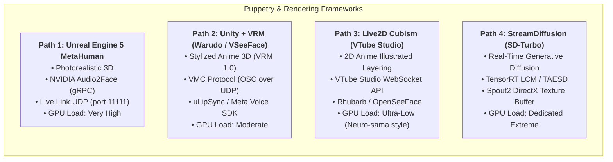
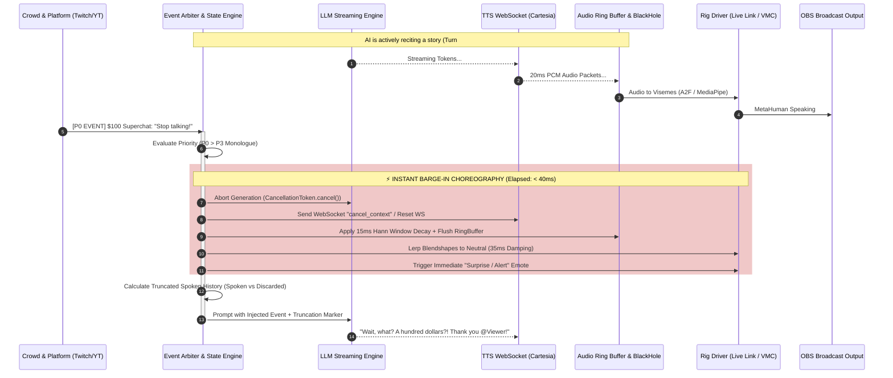

# 04. Real-Time Animation, Neural Rigging & Audio DSP

## Executive Summary

Driving a live 2D or 3D animated character at 60 FPS in a continuous broadcast loop requires sub-second audio synthesis, precise facial blendshape driving, and an interruption-safe audio ring buffer. This document specifies the visual rendering pipelines, network protocols, and audio digital signal processing (DSP) algorithms used in ALIPS.

---

## 1. Visual Rendering & Puppetry Architecture Comparison



| Dimension | Path 1: UE5 MetaHuman + Audio2Face | Path 2: Unity + Warudo / VSeeFace | Path 3: Live2D Cubism / VTube Studio | Path 4: StreamDiffusion + ComfyUI |
| :--- | :--- | :--- | :--- | :--- |
| **Visual Style** | Photorealistic 3D Digital Human | Stylized 3D Anime / Cartoon (VRM) | Hand-drawn 2D Anime Illustration | Continuous AI Generative Video |
| **Primary Driver Protocol** | **Live Link UDP** (Apple ARKit schema, port 11111) | **VMC Protocol** (OSC over UDP, port 39539 / 39540) | **VTube Studio API** (WebSocket JSON-RPC, port 8001) | Direct Spout2 shared GPU texture memory |
| **Facial Lip-Sync Engine** | NVIDIA Audio2Face-3D (TensorRT deep learning) | uLipSync / Audio2Face $\to$ OSC bridge / OVRLipSync | Rhubarb LipSync / Audio volume & pitch thresholds | Audio reactive latent warping / ControlNet openpose |
| **Blendshape Count** | 52 ARKit Blendshapes + Head Rotation + Tongue | ~60 VRM Blendshapes (VRoid/ARKit mapping) | ~30 Live2D Parameters (`MouthOpen`, `ParamAngleX`) | Latent space conditioning vectors |
| **Compute Overhead** | Very Heavy (Needs dedicated RTX 4080/4090 for Lumen/Nanite) | Moderate (Runs smoothly on RTX 3060/4060) | Very Light (< 5% GPU on any modern card) | Extreme (Requires dedicated RTX 4090 running 100% load) |
| **Stability in 24/7 Production** | Medium (Shader compilation, VRAM leaks in long sessions) | High (Battle-tested across VTuber ecosystem) | Extremely High (Near-zero crash risk in multi-day streams) | Low (Frame jitter, temporal drift, hallucination risk) |

---

## 2. Protocols, Schemas & Networking

### 2.1 Apple Live Link Face Protocol (Unreal Engine 5)
Live Link Face operates as a binary packet sent over **UDP port 11111**. It transmits a version header, subject name Pascal string, frame timecode, and 52 single-precision IEEE 754 floats:

```python
import struct
import time

def encode_livelink_frame(subject_name: str, blendshapes: dict) -> bytes:
    packet = bytearray()
    packet.append(6) # Protocol Version 6
    sub_bytes = subject_name.encode('utf-8')
    packet.extend(struct.pack('>B', len(sub_bytes)))
    packet.extend(sub_bytes)
    now = time.time()
    packet.extend(struct.pack('>IIII', int(now), int((now % 1) * 60), 60, 1))
    packet.append(52) # 52 Standard ARKit blendshapes
    for name in ARKIT_ORDERED_NAMES:
        packet.extend(struct.pack('>f', float(blendshapes.get(name, 0.0))))
    return bytes(packet)
```

### 2.2 VTube Studio WebSocket API (Live2D Injection)
VTube Studio exposes a local WebSocket server (port `8001`). Parameter injection frames format:
```json
{
  "apiName": "VTubeStudioAPI",
  "apiVersion": "1.0",
  "requestID": "lip_sync_tick_1042",
  "messageType": "InjectParameterDataRequest",
  "data": {
    "mode": "set",
    "parameterValues": [
      {"id": "MouthOpen", "value": 0.78, "weight": 1.0},
      {"id": "MouthSmile", "value": 0.35, "weight": 1.0},
      {"id": "FaceAngleX", "value": -4.2, "weight": 0.8}
    ]
  }
}
```

---

## 3. Real-Time Dynamic Interruptibility & Conversational Barge-In



### The 5 Architectural Steps of Interruption
1. **Event Priority Triage**:
   - P0: Superchats ($> \$5$), Twitch Raids, Mod voice override. Preempts active speech in $\le 40\text{ms}$.
   - P1: Subscriptions, small bits, game state changes. Preempts at next clause boundary ($< 250\text{ms}$).
   - P2: Quality chat queries. Queued for next turn.
2. **Anti-Pop Hann Cross-Fade**:
   Cutting an active audio buffer produces a harsh digital pop. ALIPS applies an inverted cosine window over 12–15ms:
   $$w(n) = \frac{1}{2} \left[ 1 + \cos\left( \frac{\pi n}{N} \right) \right]$$
3. **Upstream TTS Cancellation**:
   Dispatches a `cancel_context` WebSocket frame to Cartesia / ElevenLabs, halting server-side synthesis.
4. **Blendshape Damping to Neutral**:
   Mouth blendshapes decay exponentially toward neutral:
   $$\text{BlendShape}_t = \text{BlendShape}_{t-1} \cdot e^{-\Delta t / \tau} \quad (\tau = 25\text{ms})$$
5. **Spoken-Token Auditing**:
   Reads hardware DAC byte pointers to determine exact word completion:
   $$T_{\text{spoken}} = \frac{N_{\text{bytes}}}{\text{Channels} \times \text{BytesPerSample} \times \text{SampleRate}}$$
   Appends `[INTERRUPTED]` to the short-term memory transcript, keeping context coherent.
